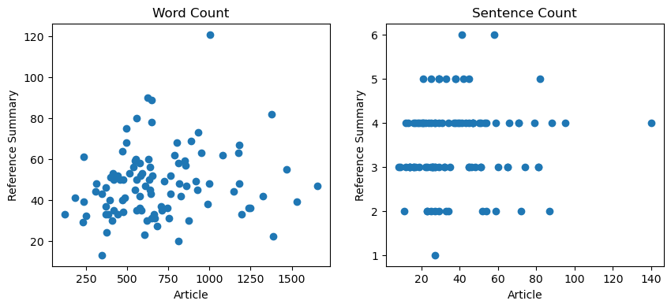

# ECE684 Final Project

Topic: Comparative Analysis of Text Summarization Techniques: A Focused Case Study on the CNN/DailyMail Dataset


This is repo to hold the source code and other materials for ECE 684 (NLP) final project with Lavsen and Zion.

## Data

CNN_DailyMail dataset [local size: 1.37 GB]

The CNN / DailyMail Dataset is an English-language dataset containing over 300k unique news articles as written by journalists at CNN and the Daily Mail. The current version (3.0.0) supports both extractive and abstractive summarization, though the original version was created for machine reading and comprehension and abstractive question answering.

> NOTE: Since the data file is too big, we choose to not upload it to the repo. Readers can download the same data using the link right below.

### Where to download

Kaggle Dataset: `cnn_dailymail` [Versions 2.0.0 and 3.0.0 of the CNN / DailyMail Dataset](https://www.aclweb.org/anthology/K16-1028.pdf).

Download link: [link](https://www.kaggle.com/datasets/gowrishankarp/newspaper-text-summarization-cnn-dailymail/data).

### Data Instances

For each instance, there is a string for the article, a string for the highlights, and a string for the id. See the [CNN / Daily Mail dataset viewer](https://huggingface.co/datasets/viewer/?dataset=cnn_dailymail&config=3.0.0) to explore more examples.

```
{'id': '0054d6d30dbcad772e20b22771153a2a9cbeaf62',
 'article': '(CNN) -- An American woman died aboard a cruise ship that docked at Rio de Janeiro on Tuesday, the same ship on which 86 passengers previously fell ill, according to the state-run Brazilian news agency, Agencia Brasil. The American tourist died aboard the MS Veendam, owned by cruise operator Holland America. Federal Police told Agencia Brasil that forensic doctors were investigating her death. The ship's doctors told police that the woman was elderly and suffered from diabetes and hypertension, according the agency. The other passengers came down with diarrhea prior to her death during an earlier part of the trip, the ship's doctors said. The Veendam left New York 36 days ago for a South America tour.'
 'highlights': 'The elderly woman suffered from diabetes and hypertension, ship's doctors say .\nPreviously, 86 pass
```

### Data Splits

The CNN/DailyMail dataset has 3 splits: train, validation, and test:

| Dataset Split | Number of Instances in Split |
| ------------- | ---------------------------- |
| Train         | 287,113                      |
| Validation    | 13,368                       |
| Test          | 11,490                       |

Below graphs shows the scatter plots of word count (left) in articles VS in provided summaries, and sentence count (right) in articles VS in provided summaries.

<p align="center">
  
</p>

> NOTE: the originally provided summaries in the CNN/DailyMail dataset are written by humans in an abstractive summarization manner, but we can also generate the extractive version by this instruction ([link](https://transformersum.readthedocs.io/en/latest/extractive/convert-to-extractive.html)). The author ([Hayden Housen](https://haydenhousen.com/)) of this instruction also open-source the code for conversion and the processed dataset, and we use it to train/test our extractive summarizers. Kudos to Hayden! 🤝

## Methods

- Method 1 (TF-IDF): Compute the average TF-IDF score for each sentence in the text, and select top 4 sentences with the highest scores in each article as the corresponding summary.
- Method 2 (BERTsum): Using a BERT-based document encoder and a RNN-based sentence extractor. To make the model more efficient, we choose to use the pre-trained DistilBERT model as the core for the encoder.
- Method 3: Pre-trained BART and T5-small are fine-tuned on CNN/DailyMail dataset and apply for abstractive summarization.

For more details, please refer to "Section 3: Methods" of the report.


## Experiment

Method 1 doesn't need any training for later inference. BERTsum, BART, and T5-small are fine-tuned on the training/validation set of CNN/DailyMail, and then tested on the testing set. We mainly used Python for the experiments, packages required includes:

```
bert_score==0.3.13
datasets==2.16.1
gradio==4.13.0
nltk==3.8.1
numpy==1.26.3
packaging==23.2
pandas==2.1.4
pyarrow==14.0.2
pyrouge==0.1.3
pytorch_lightning==2.1.2
rouge==1.0.1
rouge_score==0.1.2
scikit_learn==1.3.2
spacy==3.7.2
torch==2.1.2
torch_optimizer==0.3.0
tqdm==4.65.0
transformers==4.36.2
```

The required packages are also summarized in the `requirements.txt` file in the repo.

For more details, please refer to "Section 4.3: Implementation" of the report.


## Results

The average ROUGE scores of each method is shown below:

|             | Method 1 (TF-IDF) | Method 2 (BERTsum) | Method 3-1 (BART) | Method 3-2 (T5-small) |
| ----------- | ----------------- | ------------------ | ----------------- | --------------------- |
| avg ROUGE-1 | 0.22              | 0.37               | 0.40              | 0.38                  |
| avg ROUGE-2 | 0.05              | 0.15               | 0.18              | 0.16                  |
| avg ROUGE-L | 0.20              | 0.35               | 0.38              | 0.35                  |

For more details, please refer to "Section 5: Results And Discussion" of the report.


## Key Conclusions

- In terms of average ROUGE scores: Method 3-1 (BART) > Method 3-2 (T5-small) ~ Method 2 (BERTsum) >> Method 1 (TF-IDF). Note that method 1 and method 2 are extractive summarizers, while two methods explored in method 3 are abstractive summarizers.
- However, methods with higher ROUGE scores doesn't perform better than weaker methods on any input articles.
- In terms of the efficiency, T5-small needs the least amount of time to generate a summary.
- Fine-tuning is necessary for these pre-trained models.


## Future Work

- Measure performance by more metrics (e.g., BLEU score, METEOR score, model size, time efficiency)
- Investigate those instances where powerful methods like BART and BERTsum fails.
- Explore the model's generalizability on texts in different domains and languages.
- Applied these powerful and promising summarizers to radiology diagnostic reports.
